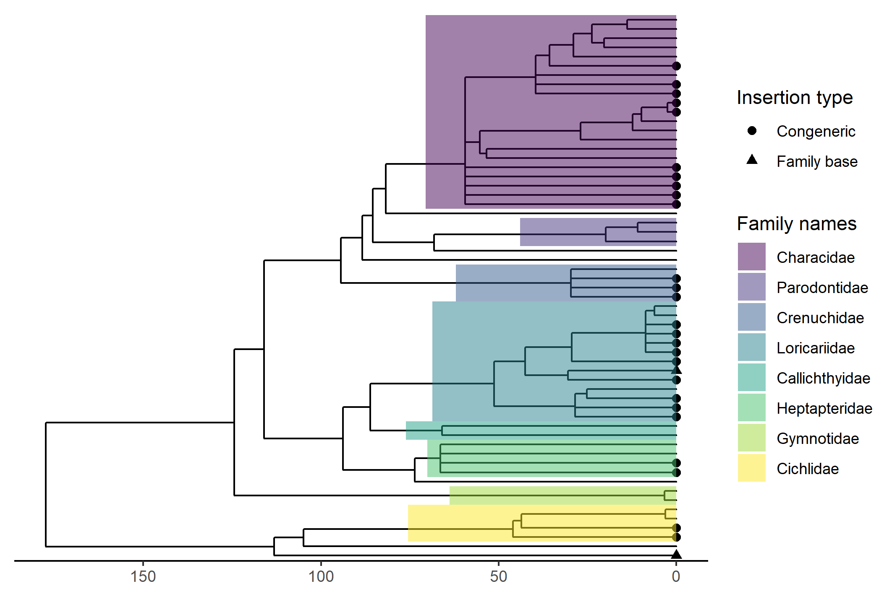

```{r setup, include=FALSE}
knitr::opts_chunk$set(echo = TRUE)
```


# FishPhyloMaker

[](https://cran.r-project.org/package=FishPhyloMaker)

[](https://codecov.io/gh/GabrielNakamura/FishPhyloMaker)

[](https://choosealicense.com/licenses/mit/)

**Making phylogenies for a local pool of fish species**

The FishPhyloMaker package has as the core function `FishPhyloMaker`, that works by downloading the [most inclusive phylogeny of bony fishes](https://fishtreeoflife.org/) provided by [Rabosky (2018)](https://onlinelibrary.wiley.com/doi/10.1111/jbi.13839) and edit this phylogeny, in a sequential way by replacing and dropping the fish species of the original phylogeny to obtain a phylogenetic tree containing only the desired species specified in a data frame. The procedure starts by adding all species of fish that already present any Genus in the tree (Congeneric species). For species that do not present any representative of the same Genus, the function finds out for all species of the same family, if not present any species in the tree the search is performed for species of the same Order. By an interactively procedure, the user must specify which Genus from that family (or families in orders) in the tree the species to be inserted is most related. The function returns a phylo object containing the phylogeny of species provide in data argument and a data frame (if argument `return.insertions = TRUE`) containing all species with an character indicating at which level the species was added in the tree. There are four possible categories in which species can be tagged regarding their order of insertion:

-   **Present_in_tree** the species was already present in the original tree;
-   **Congeneric_insertion** species inserted as a sister species of the same genus presented in the tree;
-   **Congeneric_insertion_roundFamily** species inserted as a sister species of the same genus presented in the tree, but that were added after a species of local pool of the same genus be inserted in the tree;
-   **Family_insertion** if not found any congeneric species, the species will be inserted near to, or between genus of the same family presented in the tree. The user can also insert the species in the base of the family;
-   **Order_insertion** if not found any genus of the same family of the species that must be inserted, the species will be inserted near to a given family, between two families or at the node that corresponds to the Order of this species;
-   **Not_inserted** if species was not inserted in any of the previous steps, it will not be inserted in the final tree;

The user must provide to `FishPhyloMaker` function a data frame that present the following format:

|    s  |    f    |    o   |
|:-----:|:-------:|:------:|
| G_sp1 | Family1 | Order1 |
| G_sp2 | Family2 | Order2 |
| G_sp3 | Family3 | Order3 |

This table can be done mannually or by passing to `FishTaxaMaker` a list of species or a community data matrix with species names in columns.

To install the package the user must type:

```{.r}
devtools::install_github("GabrielNakamura/FishPhyloMaker", ref = "main")
```

To run an example the user can load a data set contained in the package:

```{.r}
library(FishPhyloMaker)
data(neotropical_comm)
data_comm <- neotropical_comm[, -c(1, 2)] # removing latitude and longitude
```

This data set comprises the occurrence of 59 fish species that occur in headwater streams of 
Parana and Paraguai river Basins, in Brazil. The coordinates of these streams are presented in the two first columns of this data set.

First the user must obtain the data necessary to enter in `FishPhyloMaker`  using `FishTaxaMaker`

```{.r}
taxon_data <- FishTaxaMaker(data_comm)
Loricariidae
Siluriformes
```
`FishTaxaMaker` finds in [Fishbase](https://www.fishbase.se/search.php) for the family and the order of species provided in data argument. If any species was not find in Fishbase, the user will be asked to type the Family and the Order of this species manually. In the case of this data set, species *Curculionichthys inseperatus* was not found in Fishbase, so we inform manually the family (Loricariidae) and order (Siluriformes) of this species. This function can also be usefull to check possible mispelling errors in the name of species.


Finally run `FishPhyloMaker`

```{.r}
res_phylo <- FishPhyloMaker(data = taxon_data, return.insertions = TRUE)
Hisonotus 
Synbranchidae 
```

The species are inserted in a sequential procedure. Those species with any congeneric representatives will be printed in the console jointly with a list of Genus in which the user must choose. The user have three options: 

1. Insert **near to a specific Genus**, then the user must type the name of this Genus;
2. Insert **between to Genus**, then the user must type the names of these two Genus separated by a white space;
3. Insert **at the node that correspond to the Family** of the species being inserted. Then, the user must type the name of the Family.

The output has two objects, a phylogenetic treefor the local pool of fish species, and can be directly plot

```{.r}
plot(res_phylo$Phylogeny, cex = 0.7)
```

And a data frame indicating at which level the species of local pool was inserted (one of the six categories detailed above).

```{.r}
res_phylo$Insertions_data
```

For more details and updates in package functioning see and specific articles showing
    how to use `{FishPhyloMaker}` package see [FishPhyloMaker web page](https://gabrielnakamura.github.io/FishPhyloMaker/)
    
Here some examples of phylogenies that can be made with `{FishPhyloMaker}` package:




