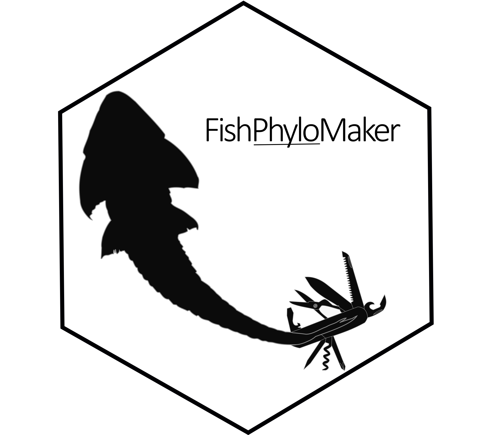

<!-- README.md is generated from README.Rmd. Please edit that file -->



# FishPhyloMaker

[](https://cran.r-project.org/package=FishPhyloMaker)

[](https://zenodo.org/badge/latestdoi/336899540)

[](https://choosealicense.com/licenses/mit/)

`{FishPhyloMaker}` is an R package that allows to construct synthesis
phylogenies for finned-ray fishes. The package has two main functions,
`FishTaxaMaker` and `FishPhyloMaker`. The first generate a data frame
from fish species names provided by the user, checking the validity of
these names and possible synonyms by using the information contained in
[Fishbase database](http://www.fishbase.org) through the package
[rfishbase](https://CRAN.R-project.org/package=rfishbase). The output of
`FishTaxaMaker()` function is a list containing the following objects:

  - **All\_info\_fishbase**: A data frame containing the taxonomic
    classification of valid species accordingly to Fishbase;

  - **Taxon\_data\_FishPhyloMaker**: A data frame with three columns
    containing the valid scientific name of the species (s), its family
    (f) and order (o). This data frame can be used in `FishPhyloMaker()`
    to generate the phylogeny;

  - **Species\_not\_in\_Fishbase**: A character vector containing the
    names of species that was not found in Fishbase with a valid name
    data frame object containing three columns with the name of species
    (s), the Family (f) and the Order (o) of all species provided by the
    user.

Besides to help checking the validity of the names of species, its
synonyms and duplicated species, the data frame returned by
`FishTaxaMaker()` in **Taxon\_data\_FishPhyoMaker** are formatted so
that it can be directly used in the core function `FishPhyloMaker()`.
This function will use the information of the taxonomic hierarchy
contained in the data frame returned from `FishTaxaMaker()`, joint with
the information present in the the [fishtree of life
project](https://fishtreeoflife.org/) to construct the phylogenetic
tree.

The paper describing the functionalities of FishPhyloMaker is now
published in Ecological Informatics and can be assessed
[here](https://www.sciencedirect.com/science/article/pii/S1574954121002727).

# Download

A stable version of FishPhyloMaker can be installed from CRAN

``` r
install.packages("FishPhyloMaker")
```

To install the development version of this package the user must type:

``` r
# install.packages("devtools")
devtools::install_github("GabrielNakamura/FishPhyloMaker", ref = "main")
```

# Example

To run an example the user can load a data set present in the package:

``` r
library(FishPhyloMaker)
data(neotropical_comm)
data_comm <- neotropical_comm[, -c(1, 2)] # removing latitude and longitude
```

This data set comprises a community matrix with the occurrences of 59
fish species in headwater streams of Parana and Paraguai River Basins,
in Brazil. The coordinates of these streams are presented in the two
first columns of this data set.

First the user must obtain the data necessary to enter in
`FishPhyloMaker` using `FishTaxaMaker` function.

``` r
taxon_data <- FishTaxaMaker(data_comm, allow.manual.insert = TRUE)
Characidae
Characiformes
Characidae
Characiformes
Characidae
Characiformes
Loricariidae
Siluriformes
Cichlidae
Cichliformes
Crenuchidae
Characiformes
Gymnotidae
Gymnotiformes
Loricariidae
Siluriformes
Loricariidae
Siluriformes
Loricariidae
Siluriformes
Loricariidae
Siluriformes
Heptapteridae
Siluriformes
Characidae
Characiformes
Loricariidae
Siluriformes
Characidae
Characiformes
```

`FishTaxaMaker` finds in [Fishbase](http://www.fishbase.org/search.php)
for the family and the order of species provided in data argument. If
any species was not find in Fishbase, the user will be asked to type the
Family and the Order of this species manually. This function can also be
useful to check possible misspelling errors in the name of species.

Finally run `FishPhyloMaker`

``` r
res_phylo <- FishPhyloMaker(data = taxon_data$Taxon_data_FishPhyloMaker,
                            insert.base.node = TRUE, 
                            return.insertions = TRUE, 
                            progress.bar = TRUE)
```

The species are inserted in a sequential procedure. Species with any
family representatives will be printed in the console jointly with a
list of Genus contained of its family contained in the three, so that
the user must choose. The user have three options:

1.  Insert **near to a specific Genus**: the user must type the name of
    this Genus;
2.  Insert **between to Genus**: the user must type the names of these
    two Genus separated by a white space;
3.  Insert **at the node that correspond to the Family** of the species
    being inserted: the user must type the name of the Family.

The output has two objects, a phylogenetic tree that can be directly
plot with the following code:

``` r
plot(res_phylo$Phylogeny, cex = 0.7)
```

And a data frame indicating at which level the species was inserted (one
of the six categories detailed above).

``` r
res_phylo$Insertions_data
```

For more details and updates see [FishPhyloMaker web
page](https://gabrielnakamura.github.io/FishPhyloMaker/)

# Next steps - To do list

  - [ ] Implement user option to insert a taxonomic table and backbone
    phylogeny
      - [x] Create two arguments to receive user phylogeny and user
        taxonomic database
      - [ ] Function to naming nodes - if not fish
      - [ ] Function to naming nodes - FISH
      - [ ] Problem with geiger - change to base functions (e.g. match
        or which)
      - [ ] New functions to insert hierarchical taxonomic levels
        (e.g. genus, family, sub-family, order)
  - [ ] Incorporate butterfly phylogeny
      - [ ] How to download the phylogeny and taxonomic list?
      - [ ] New argument to select which taxa are being used (fish,
        butterfly)
      - [ ] Other groups??
      - [ ] Criar uma tabela com dados das borbos
  - [ ] Deploy website
      - [ ] Check deploy error
      - [ ] Update vignettes
