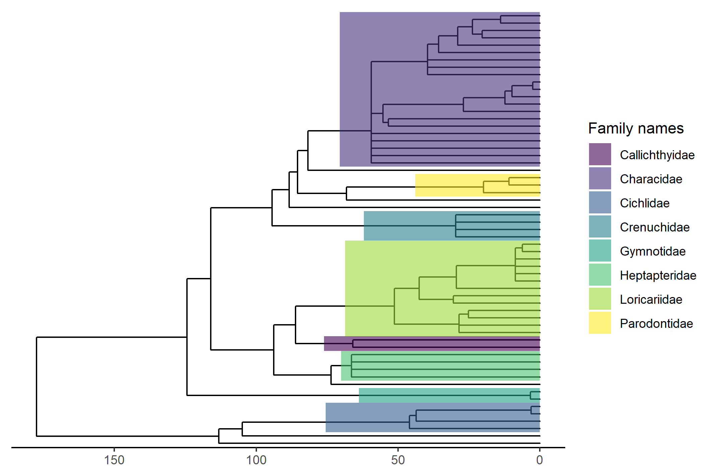

```{r, include = FALSE}
knitr::opts_chunk$set(
  collapse = TRUE,
  comment = "#>"
)
```

In this article we will show how to obtain a phylogeny for a pool of species using FishPhyloMaker package. First of all, we need to install and read `{FishPhyloMaker}` package, that can be made using the following code:


```{r install_pkg, echo=TRUE, eval=FALSE}
devtools::install_github("GabrielNakamura/FishPhyloMaker", ref = "main")
```

We will use a data base that contain stream fish species from Paraná and Paraguai basins. These comprises two of the main basins in Neotropical region. This data are embedded in the package and can be easily accessed by typing:

```{r read_data, eval=FALSE, echo=TRUE} 
library(FishPhyloMaker)
data(neotropical_comm)
data_comm <- neotropical_comm[, -c(1, 2)] # removing Latitude and Longitude
```

`neotropical_comm` correspond to a data frame containing the abundance of 59 fish species collected in 20 headwater streams, being 10 in Paraná and 10 in Paraguay Basin. To obtain a phylogenetic tree for these species we first need to format these data accordingly to enter in `FishPhyloMaker` function, that correspond to a data frame with three column containing the taxonomic information of each one of the 59 species. To prepare this data we will use the function `FishTaxaMaker` that finds for each species name present in the data_comm and checks if these names are found in [Fishbase database]("http://www.fishbase.org"). 
Note that not all species was found in Fishbase data, so, the user must type manually, through an interactive process, the name of the Family and the Order of these species that was not found. A message will appear in the command prompt indicating when to type the names. The names must be typed sequentially, as in the following code.

```{r taxon_data, echo=TRUE, eval=FALSE}
taxon_data <- FishTaxaMaker(data_comm, allow.manual.insert = TRUE)
Characidae
Characiformes
Characidae
Characiformes
Characidae
Characiformes
Loricariidae
Siluriformes
Characidae
Characiformes
Cichlidae
Cichliformes
Crenuchidae
Characiformes
Gymnotidae
Gymnotiformes
Loricariidae
Siluriformes
Loricariidae
Siluriformes
Loricariidae
Siluriformes
Loricariidae
Siluriformes
Heptapteridae
Siluriformes
Characidae
Characiformes
Loricariidae
Siluriformes
Characidae
Characiformes
```

This function will return a data frame with three columns and the same number of species present in data_comm, and now taxon_data can be used in `FishPhyloMaker` function to generate the phylogenetic tree for these species. In this example we will set the argument return.insertions = TRUE, since we want to know at which level of hierarchical taxonomy each species was inserted in the process, the levels are explained in the [introductory article](https://gabrielnakamura.github.io/FishPhyloMaker/index.html). Like `FishTaxaMaker` function, `FishPhyloMaker` also have a interactive process of insertion in which the user must inform at which position species must be inserted in the mega-tree. There are three options: 

1. **Insert the species near to a specific genus/family**: To insert the species near to a specific genus/family,
    the user must type the name of the genus (or family) at which the species must be inserted;

2. **Insert the species between two genus/families**: To insert the species between two different genus/families, the user 
    must type the names of the two genus/families separated by a blank space;

3. **Insert at the root of the family/order**: To insert the species at the node that corresponds to the family (or order), 
    the user must type the name of the family.

For each species a list of names containing Genus names or Family names will appear at command prompt, and the user
    must decide among one of the previous option.

*NOTE* - The function can take several minutes to run depending on the number of species that must be inserted.

```{r phylo_make, eval=FALSE, echo=TRUE}
phylo_fish_streams <- FishPhyloMaker(data = taxon_data, 
                                     return.insertions = TRUE,
                                     insert.base.node = TRUE, 
                                     progress.bar = TRUE)
```

In this example I choose to insert all the species that did not presented congeneric relatives in the 
    base of its family.
    
The result of `FishPhyloMaker` is a list containing two objects, a phylogenetic tree and a data frame indicating at which level each species was inserted in the phylogeny.
We can use the result contained in phylo_fish_streams to plot the tree. We can use the following code to highlight the families in the tree.

```{r plot_phylo, eval=FALSE, echo=TRUE}
library(ggtree)
tree.PR<- phylo_fish_streams$Phylogeny

tree.PR <- ape::makeNodeLabel(tree.PR)
phylo <- tree.PR

rm.famNames <- which(table(taxon_dataPR$f) == 1) # monotipic families
names.fam <- setdiff(unique(taxon_dataPR$f), names(rm.famNames)) # removing monotipic families from the names 

for (i in 1:length(names.fam)) {
  set <- subset(taxon_dataPR, f == names.fam[i])
  phylo <- ape::makeNodeLabel(phylo, "u", nodeList = list(Fam_name = set$s))
  
  phylo$node.label[which(phylo$node.label == 
                           "Fam_name") ] <- paste(set$f[1])
}

pos.node <- unlist(lapply(names.fam, function(x){
  which(phylo$node.label == x) + length(phylo$tip.label)
}))

df.phylo <- data.frame(Fam.names = names.fam,
                       node.number = pos.node)

plot.base <- ggtree(phylo) + theme_tree2()
plot1 <- revts(plot.base) + scale_x_continuous(labels=abs)


PR.PG <- plot1 + geom_hilight(data = df.phylo, aes(node = node.number, fill = Fam.names), 
                      alpha = .6) +
  scale_fill_viridis(discrete = T, name = "Family names")
```

With this code we will obtain a phylogenetic tree like that in Figure 1. The species that are not shaded with colors corresponds to monotipic families.



