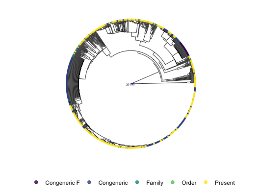

```{r, include = FALSE}
knitr::opts_chunk$set(
  collapse = TRUE,
  comment = "#>"
)
```

In this article we will show how we can map the insertions made in phylogenetic tree through the procedure realized in `FishPhyloMaker` function. Mapping the insertions is of special importance since allow to understand how the gaps in phylogenetic knowledge is distributed in the phylogetic tree. For example, we can understand if the Characidae family present more phylogenetic gaps than Loricariidae family.

This can be done by using the information contained in the output of `FishPhyloMaker` function when we set the argument `return.insertions = TRUE`. This returns a data frame containing the categories of insertion for each species, these categories are:

-   **Present_in_tree** the species was already present in the original tree;
-   **Congeneric_insertion** species inserted as a sister species of the same genus presented in the tree;
-   **Congeneric_Family_level** species inserted as a sister species of the same genus presented in the tree, but that were added after a species of local pool of the same genus be inserted in the tree;
-   **Family_insertion** if not found any congeneric species, the species will be inserted near to, or between genus of the same family presented in the tree. The user can also insert the species in the base of the family;
-   **Order_insertion** if not found any genus of the same family of the species that must be inserted, the species will be inserted near to a given family, between two families or at the node that corresponds to the Order of this species;
-   **Not_inserted** if species was not inserted in any of the previous steps, it will not be inserted in the final tree;

To obtain this data frame we need first to run `FishPhyloMaker` setting the argument `return.insertions = TRUE`. We will use data of fish occurrence in the Neotropical region present in `{FishPhyloMaker}` package.

```{r setup}
library(FishPhyloMaker)
data("spp_afrotropic")
```

We need to format this data using function `FishTaxaMaker`

```{r formatData, echo=TRUE, eval=FALSE}
taxon_data <- FishTaxaMaker(data = spp_afrotropic, allow.manual.insert = TRUE)
```

With taxon_data we can run `FishPhyloMaker` to obtain the phylogeny and the data frame with all the insertions made by each species

```{r makingPhylo, echo=TRUE, eval=FALSE}
phylo_fish_Afrotropics <- FishPhyloMaker(data = taxon_data$Taxon_data_FishPhyloMaker, 
                                         return.insertions = TRUE,
                                         insert.base.node = TRUE, 
                                         progress.bar = TRUE)
```

The data frame can be extracted and the categories of insertion can be plotted in the phylogenetic tree by using the information on `phylo_fish_SAmerica$Insertions`

```{r familyNames, echo=TRUE, eval=FALSE}
library(phytools)
library(ggtree)
library(ggplot2)
insertions_org <- phylo_fish_Afrotropics$Insertions_data[match(tree$tip.label, phylo_fish_Afrotropics$Insertions_data$s), ]
p.base <- ggtree(tree, layout = "circular", size = .3)  %<+% insertions_org +
  geom_treescale(x = 0, width = 20, linesize = .5, color = "blue", 
                 fontsize = 0) + #  plot the scale bar
  annotate("text", x = 4, y = 500, label = "20 myr", size = 1.5) # an attempt for add a scale bar

p.full <- p.base +
  geom_tippoint(aes(color = insertions), 
                size = .5, alpha = .8) +
  theme(legend.position = "bottom") +
  guides(color = guide_legend(override.aes = list(size = 2)))  +
  scale_color_viridis_d(name = NULL, na.translate = F,
                        labels = c("Congeneric F", "Congeneric", "Family", "Order", "Present")) 
```

In Figure 1 we can see all the insertions made in the insertion process.

